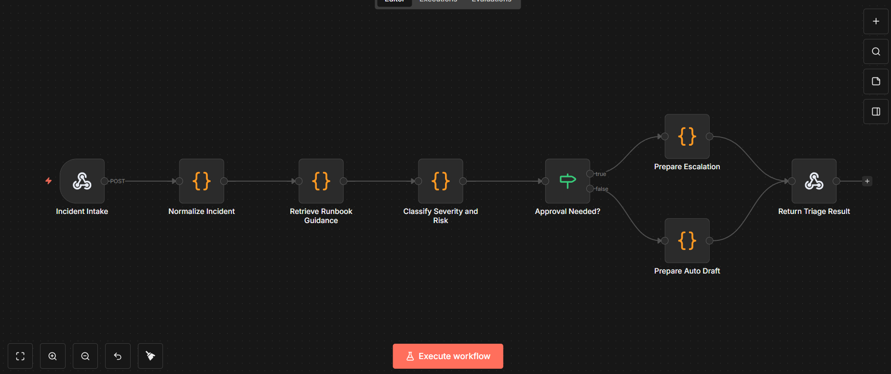
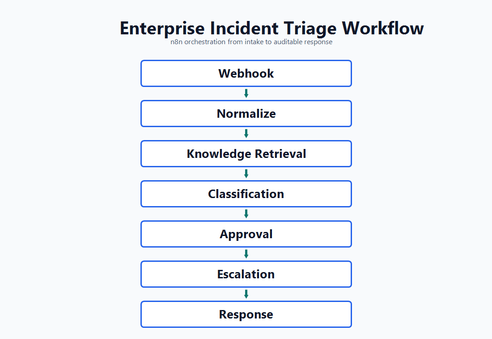
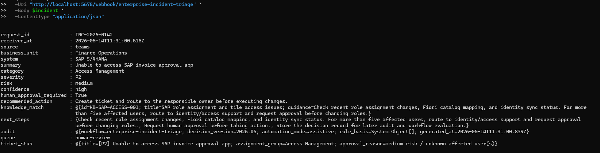
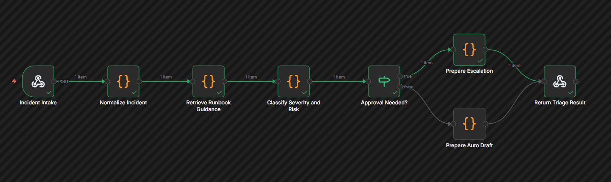

# Enterprise AI Incident Triage with n8n

I built this project to practice enterprise-style AI workflow automation with n8n. The workflow accepts an IT incident through a webhook, normalizes the request, matches it against a small runbook knowledge base, classifies severity and risk, and decides whether the case needs human approval.

The current version uses deterministic JavaScript logic and local JSON data so it can run without paid APIs. It is structured so an LLM, vector database, Jira, ServiceNow, or Microsoft Teams step can be added later.

## Workflow Preview

### n8n Workflow



### Architecture Diagram



### API Test



### Execution View



## What It Does

- Accepts an incident through a webhook
- Normalizes the request into a consistent case format
- Classifies the request by category, severity, and risk
- Retrieves matching runbook guidance from a knowledge base
- Decides whether the case can be handled automatically or needs escalation
- Produces a structured triage response with confidence, next steps, and audit fields

## Implementation Notes

This is intentionally a small local version of an enterprise incident workflow. The first version focuses on making the routing logic visible and easy to test before adding external systems.

Current scope:

- AI workflow orchestration
- IT incident and request management
- runbook-style knowledge retrieval
- Human-in-the-loop approval
- Enterprise automation
- SAP, Microsoft 365, ServiceNow, Jira, and internal support style processes

Limitations:

- The knowledge retrieval step uses keyword scoring instead of vector search.
- The workflow returns a ticket stub instead of creating a real Jira, ServiceNow, or Teams item.
- The sample incidents are synthetic and only cover a few common IT support cases.

## Tech Stack

- n8n workflow automation
- Docker Compose for local execution
- JavaScript Code nodes for transparent routing logic
- JSON knowledge base and sample incidents
- Webhook-based API interface

The included workflow runs without paid APIs. It is designed so an OpenAI-compatible API, Ollama, Jira, ServiceNow, Microsoft Teams, or Slack can be added without changing the architecture.

## Repository Structure

```text
.
├── docker-compose.yml
├── workflows/
│   └── enterprise-incident-triage.workflow.json
├── data/
│   ├── incidents.sample.json
│   └── knowledge-base.json
├── docs/
│   ├── architecture.md
│   ├── project-summary.md
│   └── linkedin-post.md
└── .env.example
```

## Quick Start

Start n8n:

```powershell
docker compose up -d
```

If Docker Desktop is still starting, you can validate the triage logic locally:

```powershell
node .\tools\triage-simulator.js
```

Open n8n:

```text
http://localhost:5678
```

Import the workflow:

```text
workflows/enterprise-incident-triage.workflow.json
```

Activate it, then call the webhook with a sample incident:

```powershell
$body = Get-Content .\data\incidents.sample.json | ConvertFrom-Json
$incident = $body[0] | ConvertTo-Json -Depth 10
Invoke-RestMethod -Method Post -Uri "http://localhost:5678/webhook/enterprise-incident-triage" -Body $incident -ContentType "application/json"
```

## Example Input

```json
{
  "request_id": "INC-2026-0142",
  "source": "teams",
  "business_unit": "Finance Operations",
  "summary": "Unable to access SAP invoice approval app",
  "description": "Several users in Finance cannot open the invoice approval tile after role changes yesterday.",
  "affected_users": 18,
  "system": "SAP S/4HANA",
  "urgency": "high"
}
```

## Example Output

```json
{
  "request_id": "INC-2026-0142",
  "category": "Access Management",
  "severity": "P2",
  "risk": "medium",
  "recommended_action": "Create ticket and route to identity/access support.",
  "human_approval_required": true,
  "knowledge_match": "SAP role assignment and tile access issues",
  "audit": {
    "workflow": "enterprise-incident-triage",
    "decision_version": "2026.05",
    "automation_mode": "assistive"
  }
}
```

## What I Would Add in Production

- Replace local knowledge matching with ChromaDB, Qdrant, or SAP HANA Cloud Vector Engine
- Add OpenAI-compatible or local Ollama model for response drafting
- Connect Jira, ServiceNow, or SAP Cloud ALM for ticket creation
- Send approval requests through Microsoft Teams or Slack
- Store audit events in PostgreSQL
- Add evaluation tests for false routing and escalation misses
